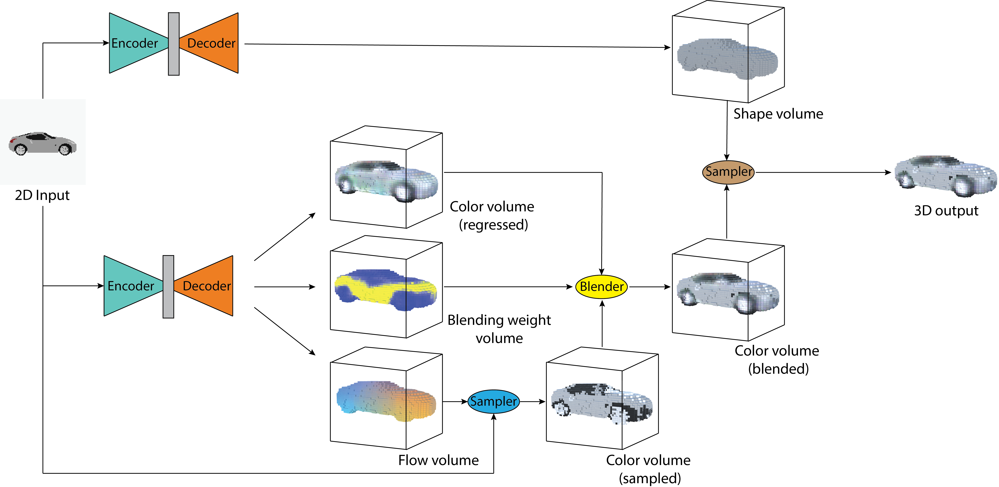
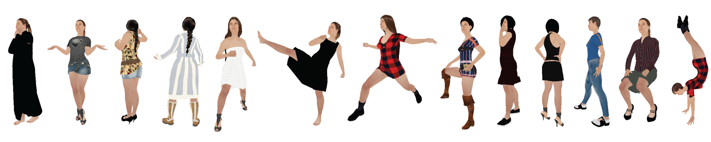

# Im2Avatar: Colorful 3D Reconstruction from a Single Image
This work reconstructs colorful 3D model from a single-view image. We tested the proposed framework on [ShapeNet](https://www.shapenet.org) sub-database and selected 3D human meshes from [MakeHuman](http://www.makehuman.org). 

[[Project]](https://liuziwei7.github.io/projects/Im2Avatar) [[Paper]](https://arxiv.org/abs/1804.06375)



## Data
We provided processed ground truth 3D color and 2D-to-3D appearance flow data. The data will be automatically downloaded for the first time running training script. Both color data and flow data are stored as 3D volumes, but with different channels (color data has 3 channels and flow data owns 2 channels). 
* Color data ranges from 0 to 1 to represent normalized colors for occupied surface voxels, and uses -1 for empty voxels. 
* Flow data ranges from 0 to 1 to represent normalized coordinates in the 2D images for occupied surface voxels, and uses -1 for empty voxels. 
For each 3D model, 12 images are provided from different viewpoints. The data indices used for training, validating and testing can be found in the **data_list** folder. Specifically, the processed ShapeNet subdataset can be downloaded from [here](https://www.dropbox.com/s/s03fc1rx4ljkhix/ShapeNetCore_im2avatar.tar.gz), and Colorful Human dataset can be downloaded from [here](https://www.dropbox.com/s/imgiu8xump2zlvm/human_im2avatar.tar.gz).



## Requirements
* [TensorFlow](https://www.tensorflow.org/)

## ShapeNet Subdataset
### Train
The model is trained per category, change the category id when working on different categories.

|    Category   |      Id       | 
| ------------- | ------------- | 
| Car           | 02958343      |
| Table         | 04379243      |
| Guitar        | 03467517      |
| Chair         | 03001627      |


* Run shape training script for car category:
``` bash
python train_shape.py --cat_id 02958343
```

* Run color training script for car category:
``` bash
python train_color.py --cat_id 02958343
```

### Inference
* To generate testing shape volumes for car category:
``` bash
python inference_shape.py --cat_id 02958343
```

* To generate testing color volumes for car category:
``` bash
python inference_color.py --cat_id 02958343
```

### Eval
After generating all the shape and color volumes, evaluate surface PSNR and IoU.
Please change the category id correspondingly within each file!
* Evaluate surface PSNR:
``` bash
python eval_surface_psnr.py
```

* Evaluate IoU:
``` bash
python eval_iou.py
```

## Colorful Human Dataset
### Train
* Run shape training script:
``` bash
python train_shape_human.py
```

* Run color training script:
``` bash
python train_color_human.py
```

### Inference
* To generate testing shape volumes:
``` bash
python inference_shape_human.py
```

* To generate testing color volumes:
``` bash
python inference_color_human.py
```


## Citation
Please cite this paper if you want to use it in your work,

	@article{sun2018im2avatar,
      title={Im2Avatar: Colorful 3D Reconstruction from a Single Image},
      author={Sun, Yongbin and Liu, Ziwei and Wang, Yue and Sarma, Sanjay E},
      journal={arXiv preprint arXiv:1804.06375},
      year={2018}
	}

## License
MIT License


